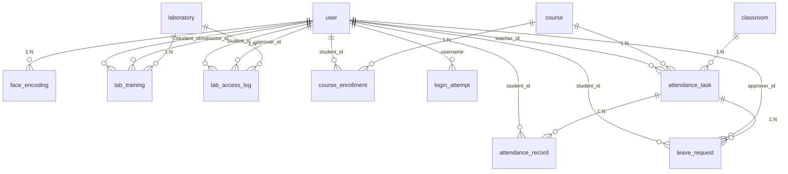

# 数据库设计

> W2 初始 10 张表 + W4 加 2 张 (course_enrollment + login_attempt) = **12 张表**

## 1. 12 张表概览

| 表 | 阶段 | 说明 |
|---|---|---|
| `user` | W2 | 三类角色统一表, role 字段区分 |
| `face_encoding` | W2 | 人脸编码, 128 维向量 BLOB 存储 |
| `course` | W2 | 课程表, 区分理论/实验 |
| `classroom` | W2 | 教室表, 含摄像头标志 |
| `laboratory` | W2 | 实验室表, 5 级安全等级 |
| `attendance_task` | W2 | 考勤任务表 |
| `attendance_record` | W2 | 考勤记录表 |
| `leave_request` | W2 (W6 接入) | 请假申请表 |
| `lab_training` | W2 (W3 接入) | 安全培训记录 |
| `lab_access_log` | W2 (W3 接入) | 准入日志 |
| `course_enrollment` | **W4 加** | 选课名单 (替代 close_task fallback 走"role=student 全部") |
| `login_attempt` | **W4 加** | 登录失败记录 (LOGIN_MAX_ATTEMPTS 防暴力) |

## 2. ER 图



## 3. 关键表结构

### user (用户表, 三类角色统一)

```sql
CREATE TABLE user (
    id            INT PRIMARY KEY AUTO_INCREMENT,
    username      VARCHAR(50) UNIQUE NOT NULL,
    password_hash VARCHAR(255) NOT NULL,  -- bcrypt $2b$12$...
    real_name     VARCHAR(50) NOT NULL,
    role          ENUM('student', 'teacher', 'lab_admin') NOT NULL,
    student_id    VARCHAR(20) UNIQUE,     -- 学生专用
    direction     VARCHAR(50),            -- 专业方向
    email         VARCHAR(100),
    phone         VARCHAR(20),
    avatar_path   VARCHAR(255),
    is_active     SMALLINT DEFAULT 1,     -- 0=禁用
    created_at    DATETIME DEFAULT CURRENT_TIMESTAMP,
    updated_at    DATETIME DEFAULT CURRENT_TIMESTAMP ON UPDATE CURRENT_TIMESTAMP
) ENGINE=InnoDB DEFAULT CHARSET=utf8mb4;
```

**角色**:
- `student`: 刷脸签到 / 请假 / 实验室准入
- `teacher`: 发起考勤 / 审批请假 / 查报表
- `lab_admin`: 实验室管理 / 培训管理 / 准入日志 / 报表

### face_encoding (人脸编码)

```sql
CREATE TABLE face_encoding (
    id          INT PRIMARY KEY AUTO_INCREMENT,
    user_id     INT NOT NULL,
    encoding    LONGBLOB NOT NULL,        -- 128 维 float32 序列化 (512 字节)
    image_path  VARCHAR(255) NOT NULL,
    is_primary  SMALLINT DEFAULT 0,       -- 1 = 主编码
    created_at  DATETIME DEFAULT CURRENT_TIMESTAMP,
    FOREIGN KEY (user_id) REFERENCES user(id) ON DELETE CASCADE
);
```

**W3 关键决策**: encoding 统一用 **float32** 序列化 (`encode_to_bytes(arr.tobytes())`),
避免 numpy 2.x 默认 float64 与 dlib 内部 float32 量纲不一致。

### attendance_record (考勤记录)

```sql
CREATE TABLE attendance_record (
    id            INT PRIMARY KEY AUTO_INCREMENT,
    task_id       INT NOT NULL,
    student_id    INT NOT NULL,
    sign_in_time  DATETIME,
    status        ENUM('present', 'late', 'absent', 'leave') DEFAULT 'absent',
    match_score   FLOAT,                  -- 0-1, sign_in_by_face 传入
    face_image    VARCHAR(255),
    created_at    DATETIME DEFAULT CURRENT_TIMESTAMP,
    UNIQUE KEY uk_task_student (task_id, student_id),  -- 同一任务同一学生唯一
    FOREIGN KEY (task_id) REFERENCES attendance_task(id) ON DELETE CASCADE,
    FOREIGN KEY (student_id) REFERENCES user(id)
);
```

**W6 关键修复**: `sign_in_by_face` 验证 user 存在 + 角色是 student,
避免 ghost user_id 抛 FK 1452 错误。

### lab_access_log (准入日志)

```sql
CREATE TABLE lab_access_log (
    id          INT PRIMARY KEY AUTO_INCREMENT,
    student_id  INT,                      -- 准入者 (可能是 teacher/admin)
    lab_id      INT NOT NULL,
    access_time DATETIME DEFAULT CURRENT_TIMESTAMP,
    granted     SMALLINT NOT NULL,        -- 1=放行 / 0=拒绝
    reason      VARCHAR(255),
    face_image  VARCHAR(255),
    FOREIGN KEY (student_id) REFERENCES user(id),
    FOREIGN KEY (lab_id) REFERENCES laboratory(id)
);
```

**W7 关键修复**: `find_by_lab` / `find_by_student` 加 `desc(id)` 作 tie-breaker,
MySQL `DATETIME` 默认精度只到秒, 同秒插入的多条记录排序稳定。

### course_enrollment (选课名单, W4 加)

```sql
CREATE TABLE course_enrollment (
    id         INT PRIMARY KEY AUTO_INCREMENT,
    course_id  INT NOT NULL,
    student_id INT NOT NULL,
    enrolled_at DATETIME DEFAULT CURRENT_TIMESTAMP,
    UNIQUE KEY uk_course_student (course_id, student_id),
    FOREIGN KEY (course_id) REFERENCES course(id) ON DELETE CASCADE,
    FOREIGN KEY (student_id) REFERENCES user(id)
);
```

**W4 关键改造**: `close_task_and_mark_absent` 用 `course_enrollment` 查学生名单,
替代原来 fallback 到"role=student 全部"的逻辑 (避免把不相关的学生标缺勤)。

### login_attempt (登录失败记录, W4 加)

```sql
CREATE TABLE login_attempt (
    id         INT PRIMARY KEY AUTO_INCREMENT,
    username   VARCHAR(50) NOT NULL,
    success    SMALLINT NOT NULL,        -- 1=成功 / 0=失败
    attempted_at DATETIME DEFAULT CURRENT_TIMESTAMP,
    INDEX idx_username_time (username, attempted_at)
);
```

**W4 防暴力**: `auth_service.login` 登录失败时记 attempt;
登录前查最近 `LOGIN_MAX_ATTEMPTS`(默认 5) 次失败次数, 超阈值抛 `账号已锁定`。

## 4. 12 张表汇总 (CHARACTER SET utf8mb4)

```
1.  user (W2)
2.  face_encoding (W2)
3.  course (W2)
4.  classroom (W2)
5.  laboratory (W2)
6.  attendance_task (W2)
7.  attendance_record (W2)
8.  leave_request (W2, W6 接入)
9.  lab_training (W2, W3 接入)
10. lab_access_log (W2, W3 接入)
11. course_enrollment (W4 新)
12. login_attempt (W4 新)
```

DDL 完整源码: [`db/schema.sql`](../db/schema.sql)

## 5. ORM 模型 (src/models/)

每个表对应一个 SQLAlchemy model, `Base.metadata.create_all(engine)` 自动建表:
- `user.py` (User)
- `face.py` (FaceEncoding)
- `course.py` (Classroom, Course, Laboratory)
- `attendance.py` (AttendanceTask, AttendanceRecord, LeaveRequest)
- `lab.py` (LabTraining, LabAccessLog)
- `course_enrollment.py` (CourseEnrollment, W4 加)
- `login_attempt.py` (LoginAttempt, W4 加)

**一致性**: schema 12 张 ↔ model 12 个 — 全部对应, W8 二次审计确认。
