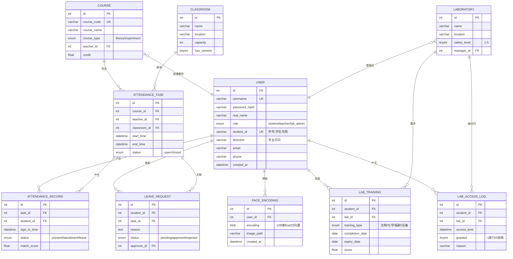

# 数据库设计

## 11 张表概览

| 表 | 域 | 说明 |
|---|---|---|
| `user` | 用户域 | 三类角色统一表，role 字段区分 |
| `face_encoding` | 人脸域 | 128 维向量 BLOB 存储 |
| `course` | 课程域 | 区分理论/实验课 |
| `classroom` | 教室域 | 普通教室，含摄像头标志 |
| `laboratory` | 实验室域 | 5 级安全等级 |
| `attendance_task` | 考勤域 | 教师发起的考勤任务 |
| `attendance_record` | 考勤域 | 学生签到记录 |
| `leave_request` | 考勤域 | 请假申请与审批 |
| `lab_training` | 安全培训域 | 学生安全培训记录与有效期 |
| `lab_access_log` | 安全准入域 | 准入日志（通过/拒绝及原因） |
| （可选）`direction_dict` | 字典域 | 5 个专业方向枚举 |

## ER 图

## 关键设计决策

### Q1：为什么人脸向量存 BLOB，不存 JSON / 文件？
- 128 个 float32 序列化为 bytes = 512 字节
- JSON 至少 1.5KB，且解析开销大
- 文件方式（每人一文件）难做数据库 JOIN 查询统计
- BLOB 可与 user 表做 JOIN，方便查"哪些用户已注册人脸"

### Q2：为什么 user 表不拆成 student / teacher / lab_admin 三张表？
- 三类用户字段高度重叠（username、password_hash、real_name、email、phone）
- 拆表带来多表 JOIN 复杂度上升，登录认证要 IF/CASE 分支
- 用 role ENUM + 学生专用字段 `student_id`、`direction` 兜底
- 演示和讲解更清晰

### Q3：为什么 attendance_record 用独立表而不是 JSON 字段存到 task 表？
- 考勤记录是核心查询对象（学生查个人、班级查整体）
- 频繁 UPDATE / INSERT，独立表性能与维护性更好
- 满足数据库原理课程对**第三范式**的展示

### Q4：专业方向为什么不单独建 direction 表？
- 5 个方向固定，频次低
- 用 VARCHAR + 应用层校验已经足够
- 强行建字典表会显得**过度设计**

## 完整 DDL

见 [../db/schema.sql](../db/schema.sql)，可直接 `mysql -u root -p < db/schema.sql` 执行。

## 关键索引

| 索引 | 表 | 用途 |
|---|---|---|
| `idx_role` | user | 角色筛选（管理员查所有教师） |
| `idx_student_id` | user | 学号登录 |
| `idx_user` | face_encoding | 某用户所有人脸编码 |
| `idx_task_student` | attendance_record | 防重复 + 学生查个人 |
| `idx_student_lab` | lab_training | 准入核验核心查询 |
| `idx_access_time` | lab_access_log | 日志倒序 |
